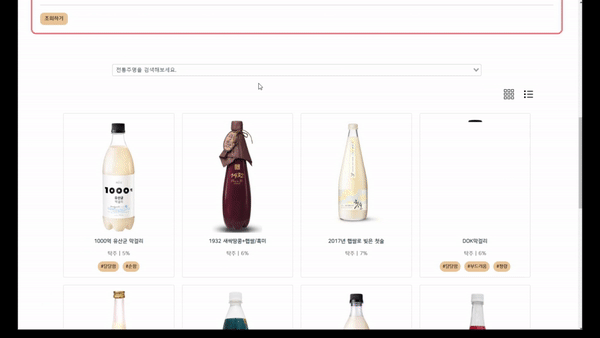

# 酒酒클럽(주주클럽)

> 도메인: 빅데이터(분산처리)

- 팀명: 한모금
- 팀원: 정종일(팀장), 김민정, 박지은, 오도석, 최연지
- 프로젝트 기간: 2022.08.22 ~ 2022.10.07 (7주)
- 프로젝트명: 酒酒클럽
- 프로젝트 소개: 태그 기반 전통주 추천 및 푸드 페어링 정보 공유 서비스

 

## 목차

* [프로젝트 기술 스택](#프로젝트-기술-스택)
* [ERD](#erd)
* [프로젝트 소개](#프로젝트-소개)
* [프로젝트 기능](#프로젝트-기능)
* [기대효과](#기대효과)
* [향후 계획](#향후-계획)
* [팀원 역할](#팀원-역할)
* [느낀점](#느낀점)
* [Jira Burndown Chart](#jira-burndown-chart)
* [산출물](#산출물)

 

## **프로젝트 기술 스택**

1. 이슈관리: Jira

2. 형상관리: Gitlab

3. 커뮤니케이션: Mattermost, Notion, Webex

4. 개발 환경

   a) OS: Windows 10

   b) IDE: IntelliJ IDEA 2022.1.4, Visual Studio Code 1.69.0

   c) Database: MySQL Ver 8.0.30

   d) Server: AWS EC2(MobaXterm 22.1)

   i) Ubuntu 20.04.2 LTS

   ii) Jenkins 2.346.2

   e) Storage: AWS S3

5. 상세내용

   a) BackEnd: Java 1.8.0, Spring Boot Gradle 7.5, Lombok 1.18.24, Swagger2, jjwt 0.9.1

   b) FrontEnd: Vue 2.6.14, Vuex 3.6.2, vue-router 3.5.1

   c) Big Data Dispersion 4: Python 3.10.5, hadoop-3.2.3, sqoop-1.4.7, spark-3.2.2

 

## ERD

 

## 프로젝트 소개

### 1. 酒酒클럽(주주클럽)

“酒酒클럽”은 SSAFY에서 시작한 빅데이터 분산처리 프로젝트로, 태그 기반 전통주 추천 및 푸드 페어링 정보 공유 서비스 제공을 목표로 시작되었다.

반응형 웹을 통해 사용자 접근성을 높였으며, 매일 업데이트되는 전통주 태그를 확인하고 추천받을 수 있다.

### 2. 기획 배경

- Jay Park ‘원소주’의 인기 → 전통주에 대한 전체적인 관심도 증가
- 전통주 활력세로 ‘푸드 페어링’ 수요도 증가
- 전통주에 관한 SNS 연관어 ‘맛집·와인·안주·한식’ 검색 증가
- 한국인이 가장 자주 접하는 음식인 한식에 맞는 전통주를 추천해줌으로써 전통주에 대한 관심도 확보 필요

 

## 프로젝트 기능

### 1. 회원 정보 관리

1. 회원가입: 아이디 중복검사 필요, 전통주 추천에 사용하기 위해 출생연도와 성별 입력

   

2. 로그인

   

3. 정보수정: 출생연도와 성별 변경 가능, 비밀번호 변경 및 회원탈퇴 페이지로 이동 가능

   

4. 회원탈퇴: 정보 수정 페이지에서 이동 가능, 비밀번호 일치 시 회원 탈퇴

   

5. 비밀번호 변경: 정보 수정 페이지에서 이동 가능, 기존 비밀번호 입력 후 일치할 경우 변경 가능

   

### 2. 전통주 추천

1. 요일 및 날씨 기반 오늘의 술 추천: 날씨 Open API 활용

   

2. 나이, 성별, 취향에 따른 전통주 맞춤 추천

   

### 3. 전통주 검색

1. 태그를 통한 전통주 검색: 매일 새벽 빅데이터 분산 처리 실시로 태그를 업데이트

   

2. 직접 검색을 통한 전통주 검색: 자동완성 기능 포함

   

3. 리스트 ↔ 바둑판식 화면 구성 전환

   

### 4. 상세 술 정보

1. 전체 화면: 술 정보, 어울리는 음식 추천, 후기 기능 제공

   

2. 전통주 후기 작성

   

### 5. 피드 기능

1. 피드 페이지: 좋아요 개수가 가장 많은 3개를 상위에 띄운다. 로그인한 사용자의 경우 피드 게시글에 좋아요 버튼을 누를 수 있다.

   

2. 피드 작성 : 피드를 작성할 전통주를 전통주명으로 검색할 수 있다. 피드에 남길 사진을 업로드 할 수 있으며 해시태그를 작성할 수 있다.

   

### 6. 마이페이지

1. 사용자 정보를 편집할 수 있다.
2. 피드를 작성할 수 있다.
3. 내가 쓴 후기와 피드를 확인할 수 있으며, 좋아요 버튼을 누른 피드 또한 확인할 수 있다.

### 7. 전통주 태그 생성

후기의 특정 단어들을 기반으로 빅데이터 분산처리 후 태그 생성

 

## 기대효과

1. 전통주에 대한 소통과 공유 활성화
2. 전통주에 대한 접근성 개선
3. 전통주를 통한 기성세대와 MZ 세대 간의 거리감 완화

 

## 향후 계획

1. 데이터 처리 시간 최적화
2. 세부적인 단위 테스트
3. 전통주 태그 리스트 업데이트를 통해 더 다양한 태그 추가

 

## 팀원 역할

| 팀원   | 직무            | 주요업무                                                     |
| ------ | --------------- | ------------------------------------------------------------ |
| 공통   | -               | \- 기획 : Notion, UI/UX(Figma), ERD  - 협업 : 코드 컨벤션 구성, 데일리 스크럼, GitLab, JIRA, Notion  - 기술 : Ubuntu, Hadoop, Spark, Sqoop, AWS, Vue, EC2 |
| 김민정 | Data, Front-End | - Python으로 크롤링 코드 작성 후 배포, Hadoop과 PySpark를 활용한 빅데이터 분산 처리  - 메인 페이지 전통주 추천, 회원 관련 페이지 및 기능 개발, 에러 디버깅 |
| 박지은 | Front-End       | 프론트엔드 컴포넌트 개발 및 페이지 디자인, API 호출 데이터 처리 |
| 오도석 | Front-End       | 백엔드 API 개발(JPA, Mysql), 무중단 자동 배포(Jenkins, Docker, Nginx), Apache Sqoop을 통한 데이터 import, export |
| 정종일 | Front-End       | 프론트엔드 컴포넌트 개발 및 페이지 디자인, API 호출 데이터 처리 |
| 최연지 | Front-End       | 백엔드 API 개발(JPA, Mysql)                                  |

 

## 느낀점

> 📌 프로젝트를 마무리하면서..

| 팀원   | 느낀점                                                       |
| ------ | ------------------------------------------------------------ |
| 김민정 | 이번 프로젝트에서 처음으로 Hadoop과 Spark를 사용해 봤는데, 프로젝트 초반에는 어떻게 데이터가 처리되는지 감을 잡을 수 없어 많이 헤맸던 것 같다. 데이터를 어떤 식으로 처리할지 팀원들과 계속해서 회의하고 그에 맞춰서 pyspark 공식 문서를 매일 찾아보며 데이터를 한 단계씩 처리해 나갈 수 있었다. 파이썬으로 크롤링 코드를 짜는 것부터 빅데이터 분산처리를 하는 것까지 일련의 과정들을 거치면서 이렇게 빅데이터를 처리해 볼 수 있다는 것이 즐거웠다. 빅데이터 처리와 프론트 업무를 번갈아가면서 하다 보니 조금 정신없었지만 팀원들 모두 밤늦게까지 소통하며 프로젝트에 임했기 때문에 더 힘을 내서 개발할 수 있었고, 그렇기 때문에 이렇게 성공적으로 프로젝트를 마무리할 수 있었던 것 같다. 프로젝트를 진행하면서 겪었던 다양한 에러들을 개인 블로그에 저장하는 습관이 생겼는데, 다음 프로젝트 때 비슷한 에러가 나온다면 이번보다 더 빨리 해결할 수 있을 것이라고 기대한다. |
| 박지은 | 프로젝트 초반에는 생각보다 순탄했던 기획과정과 이전에 경험이 있던 크롤링을 진행하면서 처음 협업하는 팀원들과 호흡을 맞춰갔고, 이후 개발 과정에서 발생한 문제들을 함께 해결하는데 도움이 된 것 같았다. 또한 처음으로 비정형데이터를 다루는 프로젝트를 진행한 것도 처음이었는데 비정형 데이터의 분석과정과 자연어 전처리 과정을 스스로 찾아보면서 새로운 것을 학습할 수 있는 기회가 되었다. 또한 처음으로 프론트 역할을 맡아 vue 를 사용하면서 이전 프로젝트들 보다 걱정과 두려움이 많이 앞선채로 시작한 프로젝트였다. 결과적으로 프론트 개발 경험과 비정형 데이터 분석 과정에 대한 이해도를 높일 수 있었던 좋은 기회였다고 생각한다. |
| 오도석 | 프로젝트를 진행하기 전에 목표는 Hadoop을 비롯한 새로운 tool을 사용해보는 것과 단순 배포 자동화가 아니라 무중단 배포 등과 같은 이전 프로젝트에서 조금 더 업그레이드된 프로젝트를 원했고 mybatis대신 jpa를 사용하고 junit을 사용한 단위테스트까지 하는 등의 많은 성과를 이뤄냈다고 생각한다. 백엔드를 담당하면서 새로운 기술을 사용하는 것도 중요했지만 보안 측면에서 매우 부족했는데 다음 프로젝트 때는 트래픽처리와 보안관리 등에 조금 더 신경을 써서 프로젝트를 진행해보고 싶다. |
| 정종일 | 프론트엔드 개발을 맡은 건 처음이라 상당한 부담감이 있었지만 각자 열심히 공부하고 같은 프론트엔드 팀원과 정보도 공유하며 생각보다 아주 괜찮은 산출물을 만들어냈다. 다만 중간에 Vue Life Cycle에 대한 이해가 미숙해 비동기 처리시 API 요청과 별개로 컴포넌트가 렌더링되어 데이터가 출력되지 않는 이슈가 있었지만 Vue 공식문서를 참고해 잘 해결해 다행이었다. 이번 프론트엔드 역할을 맡으며 백엔드 쪽에서 데이터를 넘겨줄 때 프론트엔드가 원하는 형태로 가공해 넘겨주면 코드도 깔끔해지고 상호 간의 의사소통도 더욱 쉬워진다는 것을 많이 체감했고 이를 토대로 추후 백엔드 역할을 맡을 때 적용시킬 수 있으리라 생각한다. 팀장 역할을 수행하면서 정말 부족한 부분도 많았고 챙기지 못한 부분도 많았지만 팀원들이 해당 부분을 잘 캐치해 리마인드 시켜주고 팀장역할을 편하게 수행할 수 있도록 잘 서포트해주었다. 팀원 간 의사소통의 중요성, 리더로서 어떠한 팔로워일 때 역할 수행이 원활하게 되는지도 느낄 수 있는 프로젝트였다. 이번 프로젝트를에서 본인이 가고자 하는 방향과는 다른 역할들을 수행했는데 이 과정에서 본인이 생각하지 못한 이슈들, 의사소통의 문제점들을 파악할 수 있었고 협업하는 사람의 입장을 느껴볼 수 있는 소중한 시간이었다. |
| 최연지 | 특화 프로젝트를 진행하며 예상과는 다르게 Hadoop과 Spark를 추가로 다루게 되어 진행하는 동안 부담감이 컸었다. 대부분의 개념과 기술들이 처음 접하는 것이라 낯설기도 했지만 팀원과 분산 처리 과정에 대해 소통하며 단계별로 진행하였고, 도움을 받아가며 성공적으로 데이터 처리를 할 수 있었다. 이후 백엔드를 개발하며 프론트와의 원활한 데이터 전달을 위해 API 명세 작성을 상세히 하려고 노력하였다. 이전 공통 프로젝트에서는 Swagger 외에는 API 명세를 자세히 작성하지 않아 프론트와의 요청/응답 데이터에 대해 소통을 하면서 의도치 않게 많은 시간을 허비했다고 느꼈기에 이를 개선하고자 하였다. 명세서를 통해 특정 API를 언제든 확인할 수 있었고, 프론트에서 원하는 응답 데이터 형태가 있을 경우 서로 명세서를 공유하며 편하게 수정이 가능했다. 또한 개발의 진행상황을 쉽게 공유하고 팀원 간의 의사소통이 한결 수월해짐을 경험할 수 있었다. |

 

## Jira Burndown Chart

1. 2주차 (프로젝트 기획, 데이터 크롤링)

   

2. 3주차 (ERD, Figma, 빅데이터 분산처리 시작, 프론트 및 백엔드 개발 시작)

   

3. 4주차 (데이터 분산처리 완료, 프론트 및 백엔드 개발 진행)

   

4. 5주차 (프론트 및 백엔드 에러 처리)

   

5. 6주차 (프론트 및 백엔드 에러 처리, 발표 준비, Documentation)

   

 

## 산출물

- Notion(https://www.notion.so/e109b4c80a8d4fddaec3810e9735adb3)
- Figma(https://www.figma.com/file/tgw7DC0wtSngD8uhK1Vnec/joojooclub?node-id=0%3A1)
- 회의록(https://www.notion.so/8ac73f3a41bc418e8d0bb95588752759?v=0da90b54c52d4275a46c7b7895bdc553)
- 회고(https://www.notion.so/e43bbf0ba8da4feaba63c65867f1bde2)
